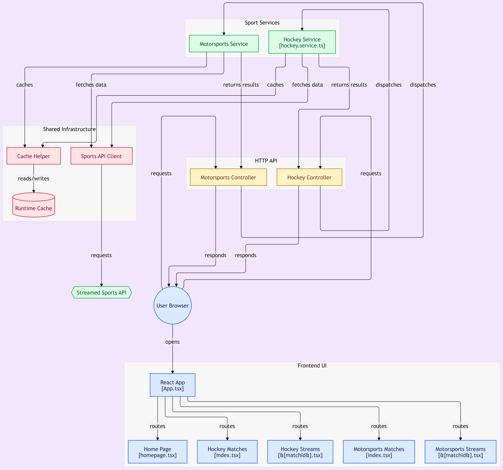

# Strockey

A full-stack sports match browser built to explore data aggregation, caching strategies, and modern frontend/backend architecture. Strockey fetches match schedules and metadata for hockey and motorsports, with a stale-while-revalidate caching layer on the backend.

> **Note**: This project was originally built as a learning exercise around API integration and caching patterns. The original external data source has since been removed/replaced, as it aggregated content in ways that raised copyright concerns. The codebase remains public to showcase the underlying architecture (NestJS module design, caching strategy, React routing), not to provide access to any specific external service.

## Tech Stack

**Backend**
- [NestJS](https://nestjs.com/) — modular, TypeScript-first Node.js framework
- [Axios](https://axios-http.com/) (via `@nestjs/axios`) — HTTP client for external API calls
- [cache-manager](https://www.npmjs.com/package/cache-manager) — in-memory caching layer
- [RxJS](https://rxjs.dev/) — reactive stream handling for HTTP responses
- `@nestjs/config` — environment-based configuration

**Frontend**
- [React](https://react.dev/) with TypeScript
- [React Router](https://reactrouter.com/) — client-side routing
- [Tailwind CSS](https://tailwindcss.com/) — utility-first styling

**Tooling**
- [Concurrently](https://www.npmjs.com/package/concurrently) — run frontend and backend dev servers together

## Architecture



The backend is organized into feature modules:

```
src/
├── common/
│   └── cache/              # Shared caching abstraction
├── sports-api/             # External API integration layer
├── hockey/                 # Hockey-specific endpoints
├── motorsports/            # Motorsports-specific endpoints
├── app.module.ts
└── app.controller.ts
```

The frontend mirrors this structure with per-sport pages and a shared layout:

```
src/
├── components/
│   └── Layout.tsx
├── pages/
│   ├── Homepage/
│   ├── hockey/
│   └── motorsports/
└── App.tsx
```

## Caching Strategy: Stale-While-Revalidate

The `CacheHelperService` implements a stale-while-revalidate pattern on top of `@nestjs/cache-manager`:

1. On a cache hit, the stale value is returned **immediately**.
2. In the background, a fresh value is fetched and the cache is updated — without blocking the response.
3. Concurrent requests for the same key share a single in-flight refresh (via an in-memory `Map`), avoiding redundant upstream calls.
4. A small random jitter is added to the TTL on cache misses, to help prevent multiple keys from expiring at the exact same time (thundering herd mitigation).

```typescript
async staleWhileRevalidate<T>(
  key: string,
  fetchFn: () => Promise<T>,
  ttl = 60,
): Promise<T>
```

This keeps response times fast and consistent even when the upstream data source is slow, while ensuring data doesn't go stale indefinitely.

## Getting Started

### Prerequisites
- Node.js 18+
- npm

### Installation

```bash
git clone https://github.com/WilliamGirouard/Strockey.git
cd Strockey
npm install
```

### Environment Variables

Create a `.env` file in the backend directory:

```env
CACHE_TTL=60
CACHE_MAX=100
```

### Running the App

```bash
npm run dev
```

This uses `concurrently` to run both the backend (NestJS) and frontend (React) dev servers in parallel.

## Key Learnings

This project was primarily an exercise in:
- Structuring a NestJS application with clear module boundaries
- Implementing a production-grade caching pattern (stale-while-revalidate with jitter)
- Handling and gracefully degrading external API failures (`SportsApiService` returns an empty array rather than throwing on upstream failure)
- Building a multi-page React app with nested, parameterized routes

## License

See [LICENSE](./LICENSE).
